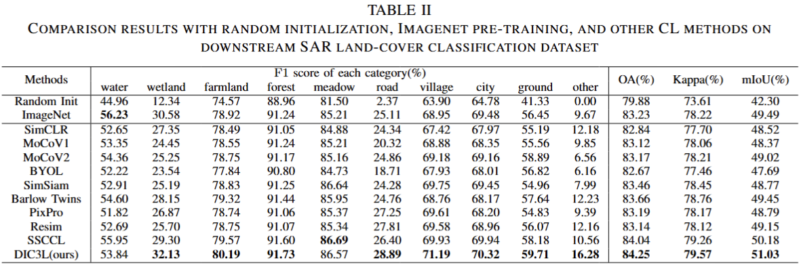
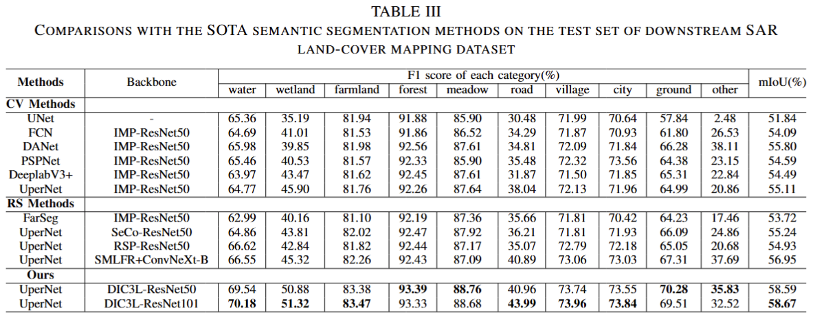

# DIC3L

**Contrastive Learning With Dynamic Instances and Contour Consistency for SAR Land-Cover Classification Foundation Model**

## Abstract

Although significant advances have been achieved in SAR land-cover classification, recent methods remain predominantly focused on supervised learning, which relies heavily on extensive labeled datasets. This dependency not only limits scalability and generalization but also restricts adaptability to diverse application scenarios. In this paper, a general-purpose foundation model for SAR land-cover classification is developed, serving as a robust cornerstone to accelerate the development and deployment of various downstream models. Specifically, a Dynamic Instance and Contour Consistency Contrastive Learning (DIC3L) pre-training framework is presented, which incorporates a Dynamic Instance (DI) module and a Contour Consistency (CC) module. DI module enhances global contextual awareness by enforcing local consistency across different views of the same region. CC module leverages shallow feature maps to guide the model to focus on the geometric contours of SAR land-cover objects, thereby improving structural discrimination. Additionally, to enhance robustness and generalization during pre-training, a large-scale and diverse dataset named SARSense, comprising 460,532 SAR images, is constructed to enable the model to capture comprehensive and representative features. To evaluate the generalization capability of our foundation model, we conducted extensive experiments across a variety of SAR land-cover classification tasks, including SAR land-cover mapping, water body detection, and road extraction. The results consistently demonstrate that the proposed DIC3L outperforms existing methods. Our code and pre-trained weights are publicly available at: https://github.com/SARpre-train/DIC3L.

## Framework

the overall workflow of the proposed DIC3L framework, where IS denotes the intersection region shared by the two augmented views.

## Experiments

Comparison results with random initialization, imagenet pre-training, and other cl methods on downstream sar land-cover classification dataset. Our pre-training framework outperforms imagenet weights and other contrastive learning methods.

Comparisons with the sota semantic segmentation methods on the test set of downstream sar land-cover mapping dataset. Models built with our weights outperform those built with other sota weights.

# Start

python main_dic3l.py   -a resnet101   --lr 0.03   --dist-url 'tcp://localhost:10001' --multiprocessing-distributed --world-size 1 --rank 0 --mlp --moco-t 0.2 --aug-plus --cos   /home/ma-user/work/SAR_data
*Specific codes will be made public later

# Weights
*Specific weights will be made public later
